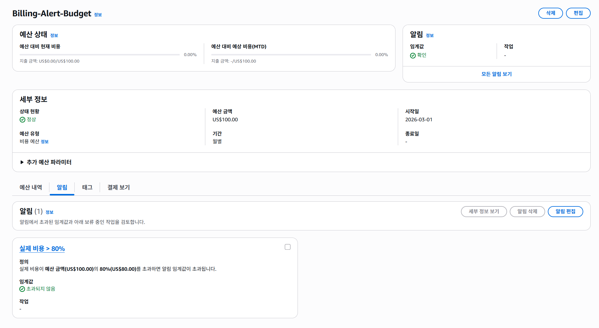
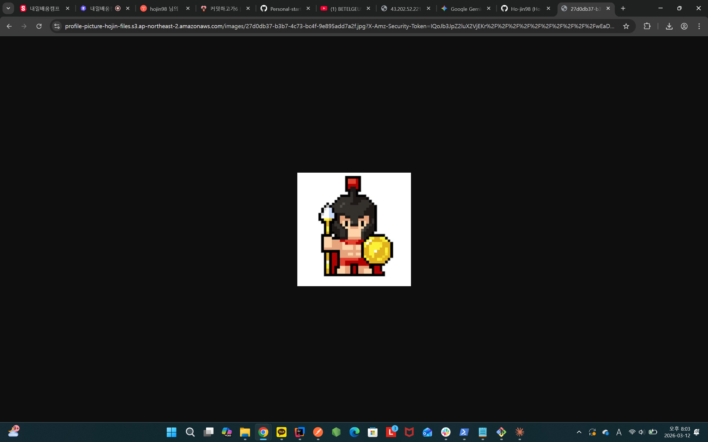

# ☁️ Cloud Architecture - Spring Boot AWS 배포 과제

## 📌 프로젝트 소개

Spring Boot 기반의 팀원들의 API 서버를 AWS 인프라 위에 설계하고 배포한 과제입니다.

EC2, RDS, S3, Parameter Store 등 AWS 핵심 서비스를 직접 구성하고, 프로필 이미지 업로드/다운로드 기능까지 구현했습니다.

---

## 🌐 배포 정보

| 항목 | 내용 |
|------|------|
| EC2 Public IP | `43.202.52.221` |
| Health Check | http://43.202.52.221:8080/actuator/health |
| Actuator Info | http://43.202.52.221:8080/actuator/info |

---
### 💰 AWS Budget



---
### 🏦 RDS 보안 그룹 (인바운드 규칙)


---
### ✅ Presigned URL 접근 성공



---

## 🔒 보안 설계

### 보안 그룹 체이닝
- EC2 보안 그룹 (`member-security-group`) : 8080 포트 허용
- RDS 보안 그룹 (`rds-security-group`) : EC2 보안 그룹 ID만 MySQL 접근 허용
  → RDS에 직접 외부 접근 불가, EC2를 통해서만 접근 가능

### IAM Role 방식 (Access Key 미사용)
- EC2에 `EC2ParameterStoreAccess` 역할 부여
- Parameter Store 접근 권한 + `AmazonS3FullAccess` 포함
- 코드에 Access Key / Secret Key 하드코딩 없음

### AWS Parameter Store
민감 정보를 코드가 아닌 AWS Parameter Store에 저장하여 관리
```
/cloud-architecture/prod/spring.datasource.url
/cloud-architecture/prod/spring.datasource.username
/cloud-architecture/prod/spring.datasource.password
/cloud-architecture/prod/team-name
```
---

## 🔌 API 명세

### 회원 생성
```
POST /api/members
```
**Request Body**
```json
{
  "name": "홍길동",
  "age": 25,
  "mbti": "ESTP"
}
```
**Response**
```json
{
  "success": true,
  "data": {
    "id": 1,
    "name": "홍길동",
    "age": 25,
    "mbti": "ESTP"
  },
  "error": null
}
```

---

### 회원 조회
```
GET /api/members/{id}
```
**Response**
```json
{
  "success": true,
  "data": {
    "id": 1,
    "name": "홍길동",
    "age": 25,
    "mbti": "ESTP"
  },
  "error": null
}
```

---

### 프로필 이미지 업로드
```
POST /api/members/{id}/profile-image
Content-Type: multipart/form-data
```
**Request**
- `image` : 이미지 파일 (MultipartFile)

**Response**
```json
{
  "success": true,
  "data": null,
  "error": null
}
```

---

### 프로필 이미지 다운로드 (Presigned URL)
```
GET /api/members/{id}/profile-image
```
**Response**
```json
{
  "success": true,
  "data": "https://버킷명.s3.ap-northeast-2.amazonaws.com/images/UUID.jpg?X-Amz-Expires=604800&X-Amz-Signature=..."
}
```
> Presigned URL 유효기간: **7일** 

---

## 🔍 Actuator 엔드포인트

| 엔드포인트 | 설명 |
|-----------|------|
| `/actuator/health` | 애플리케이션 상태 확인 |
| `/actuator/info` | 팀 정보 조회 (Parameter Store에서 team-name 주입) |

```
GET /actuator/health
```
**Response**
```json
{
  "groups": [
    "liveness",
    "readiness"
  ],
  "status": "UP"
}
```

```
GET /actuator/info
```
**Response**
```json
{
  "app": {
    "team-name": "team-sparta-spring3"
  }
}
```
---

## 📊 S3 이미지 업로드 흐름

```
Client
  │  (multipart/form-data)
  ▼
Controller (@RequestParam MultipartFile image)
  │
  ▼
MemberService
  │
  ├── S3Uploader.upload()
  │     ├── UUID로 고유 파일명 생성 (images/UUID.확장자)
  │     ├── S3에 파일 업로드
  │     └── 파일 경로 반환 (ex. images/UUID.jpg)
  │
  └── profileImageUrl DB 저장
```

```
Client (GET 요청)
  │
  ▼
MemberService
  │
  ├── DB에서 profileImageUrl 조회
  │
  └── S3Uploader.getPresignedUrl()
        ├── 파일 경로를 키로 사용
        ├── 유효기간 7일 서명
        └── Presigned URL 반환 → Client
```

---
## 🏗️ 아키텍처

```
Client
  │
  ▼
EC2 (Spring Boot :8080)
  │
  ├──── RDS (MySQL) ──── 보안그룹 체이닝 (EC2 SG → RDS SG)
  │
  ├──── S3 (프로필 이미지 저장) ──── IAM Role (AmazonS3FullAccess)
  │
  └──── Parameter Store (민감 정보 관리)
              ├── spring.datasource.url
              ├── spring.datasource.username
              ├── spring.datasource.password
              └── team-name
```

---

## ⚙️ 기술 스택

| 분류 | 기술 |
|------|------|
| Language | Java 17 |
| Framework | Spring Boot |
| Database | MySQL (RDS), H2 (Local) |
| Cloud | AWS EC2, RDS, S3, Parameter Store |
| ORM | Spring Data JPA |
| Build | Gradle |

---

## 📁 프로젝트 구조

```
src/main/java/com/example/cloudArchitecture
├── common
│   ├── CommonResponse.java
│   └── S3Uploader.java
├── config
│   ├── GlobalExceptionHandler.java
│   ├── LoggingInterceptor.java
│   ├── S3Config.java
│   └── WebMvcConfig.java
├── controller
│   └── MemberController.java
├── dto
│   ├── request
│   │   └── CreateMemberRequest.java
│   └── response
│       ├── CreateMemberResponse.java
│       └── GetMemberResponse.java
├── entity
│   └── Member.java
├── exception
│   ├── ErrorCode.java
│   ├── ErrorResponse.java
│   ├── MemberException.java
│   ├── ServerException.java
│   └── ServiceException.java
├── repository
│   └── MemberRepository.java
└── service
    └── MemberService.java
```

---

## 📦 의존성

```gradle
dependencies {
    implementation 'org.springframework.boot:spring-boot-starter-actuator'
    implementation 'org.springframework.boot:spring-boot-starter-data-jpa'
    implementation 'org.springframework.boot:spring-boot-starter-web'
    implementation 'org.springframework.boot:spring-boot-starter-validation'
    implementation platform('io.awspring.cloud:spring-cloud-aws-dependencies:4.0.0-RC1')
    implementation 'io.awspring.cloud:spring-cloud-aws-starter-s3'
    implementation 'io.awspring.cloud:spring-cloud-aws-starter-parameter-store'
    compileOnly 'org.projectlombok:lombok'
    runtimeOnly 'com.mysql:mysql-connector-j'
    runtimeOnly 'com.h2database:h2'
    annotationProcessor 'org.projectlombok:lombok'
}
```

---

## 🗂️ 환경 설정 (Profile 분리)

| 파일 | 환경 | DB | 비고 |
|------|------|-----|------|
| `application.yml` | 공통 | - | 공통 설정 (로깅, Actuator 등) |
| `application-local.yml` | 로컬 | H2 | 개발/테스트용 |
| `application-prod.yml` | 운영 | MySQL (RDS) | AWS 연동 |


### EC2 운영 실행
```bash
# 1. 빌드
./gradlew build

# 2. JAR 업로드
scp -i [키페어경로] [로컬파일] [사용자]@[EC2-퍼블릭IP]:~/app.jar

# 3. EC2 접속
ssh -i [키페어경로] ec2-user@[EC2-퍼블릭 IP]

# 4. 실행
java -jar app.jar --spring.profiles.active=prod
```


---

## 🔧 트러블슈팅

### 1. JAR 업로드 오류 - No such file or directory
- **원인** : EC2에 접속한 상태에서 scp 명령어 실행
- **해결** : `exit`으로 EC2 접속 종료 후 로컬 터미널에서 실행

### 2. Schema validation: missing table [members]
- **원인** : `ddl-auto: validate` 설정인데 RDS에 테이블 없음
- **해결** : RDS에 직접 `CREATE TABLE` 실행

### 3. Schema validation: missing column [profile_image_url]
- **원인** : 엔티티에 필드 추가 후 RDS 테이블 미반영
- **해결** : `ALTER TABLE members ADD COLUMN profile_image_url VARCHAR(255)` 실행

### 4. Presigned URL 중복 생성 문제
- **원인** : `upload()` 반환값이 URL 전체여서 `.key(URL전체)`로 들어감
- **해결** : `upload()` 반환값을 파일 경로만(`images/UUID.jpg`)으로 수정

### 5. AWS SDK 버전 충돌
- **원인** : BOM과 개별 SDK 버전을 동시에 명시해서 충돌
- **해결** : 개별 버전 명시 제거, BOM으로만 버전 통합 관리

### 6. Could not resolve placeholder 'cloud.aws.s3.bucket'
- **원인** : `cloud.aws.region`이 `spring` 하위에 잘못 중첩
- **해결** : `cloud.aws.region.static`을 최상위 레벨로 이동

### 7. MaxUploadSizeExceededException
- **원인** : `max-file-size`만 설정하고 `max-request-size`는 기본값(1MB) 유지
- **해결** : `max-request-size: 10MB` 추가
---

<div align="center">
  <br>
  <b>시간내어 봐주셔서 감사합니다!</b><br>
  <p align="center">
  <p align="center">
  
  <br>
  <p align="center">
  </p>
</div>
